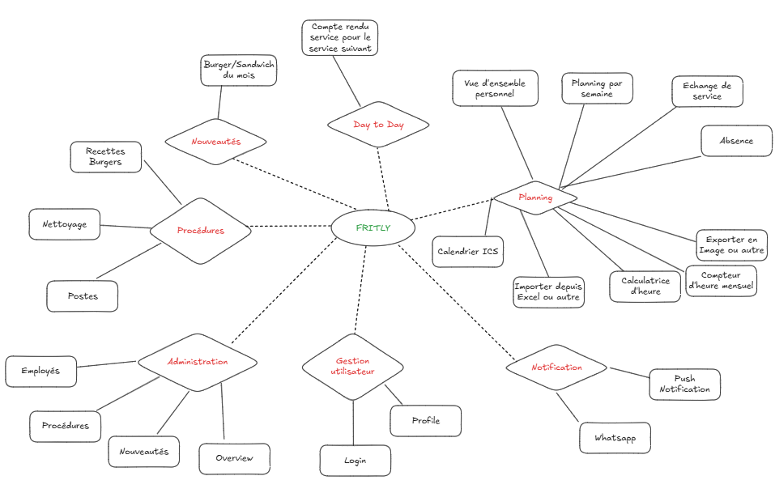
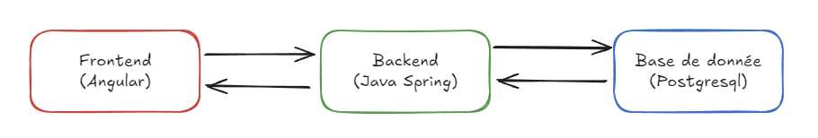

<link rel="stylesheet" href="assets/style.css">

## 1. Introduction

### Pourquoi ce projet ?
Après plusieurs années à travailler dans une friterie, j’ai réalisé qu’une bonne partie du quotidien pouvait être simplifiée. Les plannings se faisaient souvent à la main, les procédures étaient éparpillées et il n’existait pas d’outil centralisé pour tout rassembler.

### L’objectif
Créer une application pensée pour les employés :

gérer facilement les horaires, absences et remplacements,

centraliser toutes les informations utiles (procédures, fiches quotidiennes, etc.),

et poser les bases pour ajouter d’autres fonctionnalités au fur et à mesure des besoins.

### Une collaboration
Je développe l’application, tandis qu’un ami graphiste/designer s’occupe de l’UX/UI. L’idée est d’allier fonctionnalité et ergonomie dès le départ.

---

## 2. Fonctionnalités principales

  

    Fritly regroupe tout ce dont les employés ont besoin pour simplifier leur quotidien.
    L’idée est de commencer par les fonctionnalités essentielles et d’élargir progressivement
    en fonction des retours et des besoins réels sur le terrain.
  

  <!-- IMAGE : Schéma des fonctionnalités -->
  

    
  

  

    Les fonctionnalités actuellement prévues incluent :
    <ul>
      <li>Gestion des plannings (horaires, absences et remplacements)</li>
      <li>Centralisation des procédures (recettes, nettoyage, organisation des postes)</li>
      <li>Fiches quotidiennes pour le suivi des tâches</li>
      <li>Collecte des suggestions et idées (ex. “burger du mois”)</li>
    </ul>
    De nouvelles idées seront intégrées au fur et à mesure, en fonction des besoins exprimés par les utilisateurs.
  

---

## 3. Stack & Tools

  

    Fritly repose sur une stack moderne, pensée pour offrir une application performante et facile à utiliser,
    tout en restant simple à déployer pour les employés.
  

  <!-- IMAGE : Schéma architecture (Frontend -> Backend -> BDD) -->
  

    
  

  <h3>Technologies principales</h3>
  <ul>
    <li><strong>Angular :</strong> pour un frontend réactif et ergonomique.</li>
    <li><strong>Spring Boot :</strong> pour un backend robuste et sécurisé.</li>
    <li><strong>PostgreSQL :</strong> pour une base de données fiable et performante.</li>
  </ul>

  

    L’application est développée comme une <strong>PWA (Progressive Web App)</strong>, 
    ce qui permet :
  

  <ul>
    <li>Une installation directe depuis le navigateur (pas besoin d’app store).</li>
    <li>Des mises à jour instantanées pour tous les utilisateurs.</li>
    <li>Une expérience proche du natif tout en restant légère et simple à maintenir.</li>
  </ul>

  <h3>Outils de conception et de gestion</h3>
  
Plusieurs outils accompagnent le développement du projet :

  <ul>
    <li><strong>Figma :</strong> pour la création des maquettes UX/UI en collaboration avec le designer.</li>
    <li><strong>Jira :</strong> pour organiser les tâches et suivre la méthode Agile (Scrum simplifié).</li>
    <li><strong>GitLab :</strong> pour la gestion du dépôt et du CI/CD.</li>
    <li><strong>IntelliJ IDEA :</strong> comme IDE principal pour le développement backend.</li>
  </ul>
  
  

    
  

  
  <!-- IMAGES : Screens Figma, Jira, GitLab -->
  

    
    
     
  

---

## 4. Organisation & Méthodologie
- Méthode **Scrum simplifiée** : backlog, itérations courtes, priorisation des fonctionnalités essentielles.  
- Répartition des rôles :
  - **Moi** : développement complet, CI/CD, déploiement  
  - **Collaborateur** : UX/UI et design des interfaces (via Figma)

---

## 5. CI/CD & Environnements
- **Branches Git** : `dev` pour les développements, `main` pour la production  
- **Pipeline GitLab CI/CD** :  
  - Lancement des tests automatiques  
  - Build Docker de l’application  
  - Déploiement automatique selon la branche (dev ou prod)

*(Schéma : fonctionnement du pipeline CI/CD)*  
*(Schéma : architecture app - Frontend → Backend → Base de données)*

---

## 6. Avancement du projet
- **Déjà réalisé** : *(liste rapide, ex. maquettes Figma, base de l’API, premier prototype frontend, pipeline CI/CD configuré, etc.)*  
- **En cours / à venir** :
  - Développement complet des fonctionnalités
  - Tests utilisateurs internes
  - Déploiement en production
  - Améliorations basées sur les retours des employés
