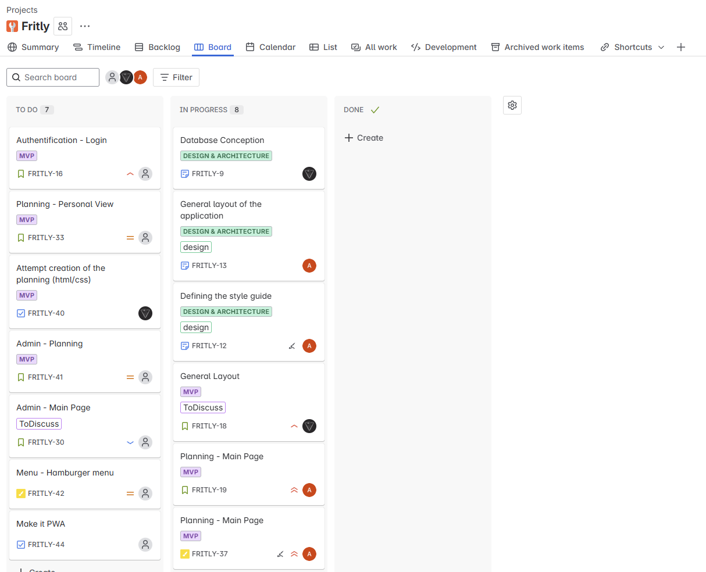
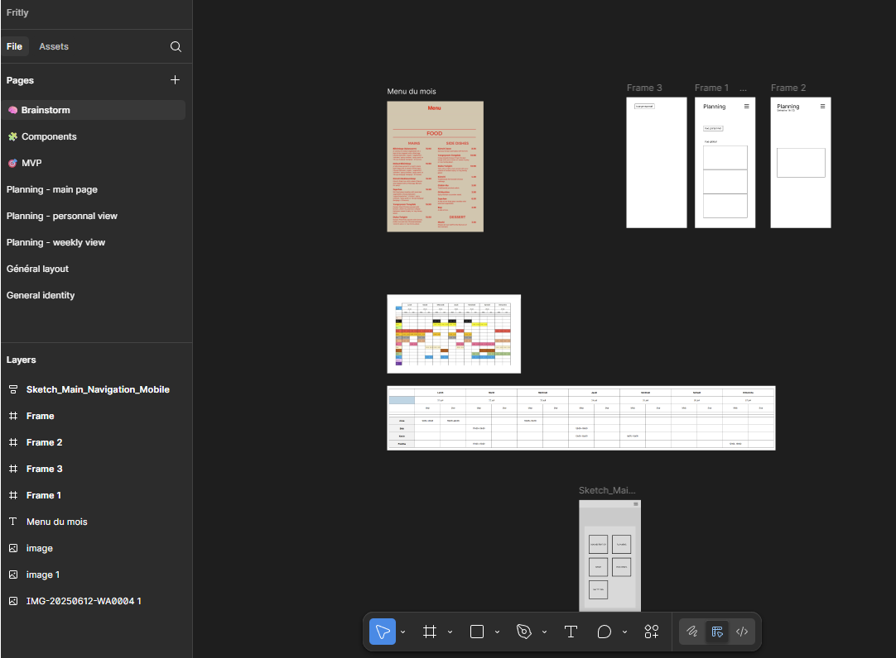
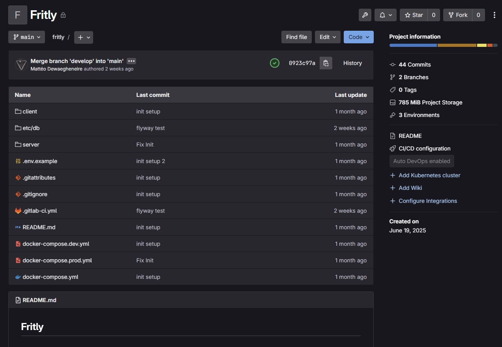

<link rel="stylesheet" href="assets/style.css">

## 1. Introduction

### Pourquoi ce projet ?
Après plusieurs années à travailler dans une friterie, j’ai réalisé qu’une bonne partie du quotidien pouvait être simplifiée. Les plannings se faisaient souvent à la main, les procédures étaient éparpillées et il n’existait pas d’outil centralisé pour tout rassembler.

### L’objectif
Créer une application pensée pour les employés :

- gérer facilement les horaires, absences et remplacements,
- centraliser toutes les informations utiles (procédures, fiches quotidiennes, etc.),
- et poser les bases pour ajouter d’autres fonctionnalités au fur et à mesure des besoins.

### Une collaboration
Je développe l’application, tandis qu’un ami graphiste/designer s’occupe de l’UX/UI. L’idée est d’allier fonctionnalité et ergonomie dès le départ.

---

## 2. Fonctionnalités principales

  

    Fritly regroupe tout ce dont les employés ont besoin pour simplifier leur quotidien.
    L’idée est de commencer par les fonctionnalités essentielles et d’élargir progressivement
    en fonction des retours et des besoins réels sur le terrain.
  

  <!-- IMAGE : Schéma des fonctionnalités -->
  

    
  

  

    Les fonctionnalités actuellement prévues incluent :
    <ul>
      <li>Gestion des plannings (horaires, absences et remplacements)</li>
      <li>Centralisation des procédures (recettes, nettoyage, organisation des postes)</li>
      <li>Fiches quotidiennes pour le suivi des tâches</li>
      <li>Collecte des suggestions et idées (ex. “burger du mois”)</li>
    </ul>
    De nouvelles idées seront intégrées au fur et à mesure, en fonction des besoins exprimés par les utilisateurs.
  

---

## 3. Stack & Tools

  

    Fritly repose sur une stack moderne, pensée pour offrir une application performante et facile à utiliser,
    tout en restant simple à déployer pour les employés.
  

  <!-- IMAGE : Schéma architecture (Frontend -> Backend -> BDD) -->
  

    
  

  <h3>Technologies principales</h3>
  <ul>
    <li><strong>Angular :</strong> pour un frontend réactif et ergonomique.</li>
    <li><strong>Spring Boot :</strong> pour un backend robuste et sécurisé.</li>
    <li><strong>PostgreSQL :</strong> pour une base de données fiable et performante.</li>
  </ul>

  

    L’application est développée comme une <strong>PWA (Progressive Web App)</strong>, 
    ce qui permet :
  

  <ul>
    <li>Une installation directe depuis le navigateur (pas besoin d’app store).</li>
    <li>Des mises à jour instantanées pour tous les utilisateurs.</li>
    <li>Une expérience proche du natif tout en restant légère et simple à maintenir.</li>
  </ul>

  <h3>Outils de conception et de gestion</h3>
  
Plusieurs outils accompagnent le développement du projet :

  <ul>
    <li><strong>Figma :</strong> pour la création des maquettes UX/UI en collaboration avec le designer.</li>
    <li><strong>Jira :</strong> pour organiser les tâches et suivre la méthode Agile (Scrum simplifié).</li>
    <li><strong>GitLab :</strong> pour la gestion du dépôt et du CI/CD.</li>
    <li><strong>IntelliJ IDEA :</strong> comme IDE principal pour le développement backend.</li>
  </ul>
  
  

    
  

  
  <!-- IMAGES : Screens Figma, Jira, GitLab -->
  

    

      
      
Suivi de projet et gestion des sprints avec Jira.

    

    

      
      
Prototypage et design des interfaces avec Figma.

    

    

      
      
Gestion du code, intégration continue et déploiement via GitLab.

    

  

---

## 4. Organisation & Méthodologie

  <h3>Introduction à Agile et Scrum</h3>
  

    Agile Scrum est une méthode de gestion de projet qui privilégie la flexibilité et l’adaptation.   
    Plutôt que de planifier un projet en entier dès le départ, Scrum découpe le travail en cycles courts, appelés <em>sprints</em>.   
    À la fin de chaque sprint, on obtient une version fonctionnelle du produit, permettant d’ajuster rapidement les priorités en fonction des retours.
  

  

    
    
Cycle de la méthode Scrum.

  

  <h3>Notre adaptation de Scrum</h3>
  

    Sur Fritly, nous appliquons Scrum de manière adaptée à notre contexte.   
    Nous ne réalisons pas de réunions quotidiennes (« daily scrums »), car nous travaillons à temps partiel sur le projet et chacun avance selon ses disponibilités.    
    À la place, nous faisons des points ponctuels pour faire le bilan, réaligner les objectifs et ajuster le backlog si nécessaire.
  

  <h3>Gestion des versions : MVP et au-delà</h3>
  

    Actuellement, nous sommes en phase de <strong>MVP</strong> (Minimum Viable Product).   
    Cela signifie que nous développons d’abord une base solide avec les fonctionnalités essentielles pour rapidement tester le produit.    
    Après cette étape, nous prévoyons un développement itératif, avec des ajouts, améliorations et corrections, toujours guidés par les retours utilisateurs.
  

  <h3>Qui travaille sur Fritly ?</h3>
  

    Le projet est porté par deux personnes :  
    <ul>
      <li>je m’occupe du développement, du déploiement, de la gestion du CI/CD, de l’analyse et de la planification,</li>
      <li>tandis qu’un ami graphiste est responsable du design UX/UI.</li>
    </ul>
    Cette organisation nous permet de couvrir l’ensemble des besoins du projet malgré notre petite équipe.
  

---

## 5. CI/CD & Environnements
- **Branches Git** : `dev` pour les développements, `main` pour la production  
- **Pipeline GitLab CI/CD** :  
  - Lancement des tests automatiques  
  - Build Docker de l’application  
  - Déploiement automatique selon la branche (dev ou prod)

*(Schéma : fonctionnement du pipeline CI/CD)*  
*(Schéma : architecture app - Frontend → Backend → Base de données)*

---

## 6. Avancement du projet
- **Déjà réalisé** : *(liste rapide, ex. maquettes Figma, base de l’API, premier prototype frontend, pipeline CI/CD configuré, etc.)*  
- **En cours / à venir** :
  - Développement complet des fonctionnalités
  - Tests utilisateurs internes
  - Déploiement en production
  - Améliorations basées sur les retours des employés
