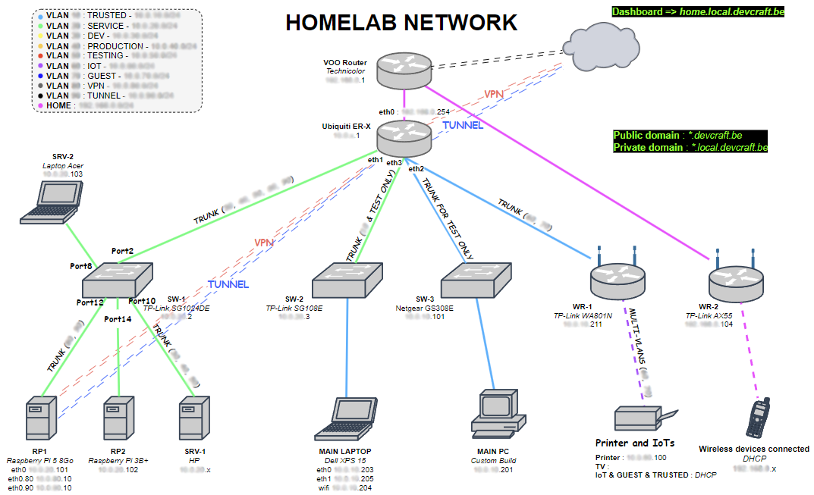
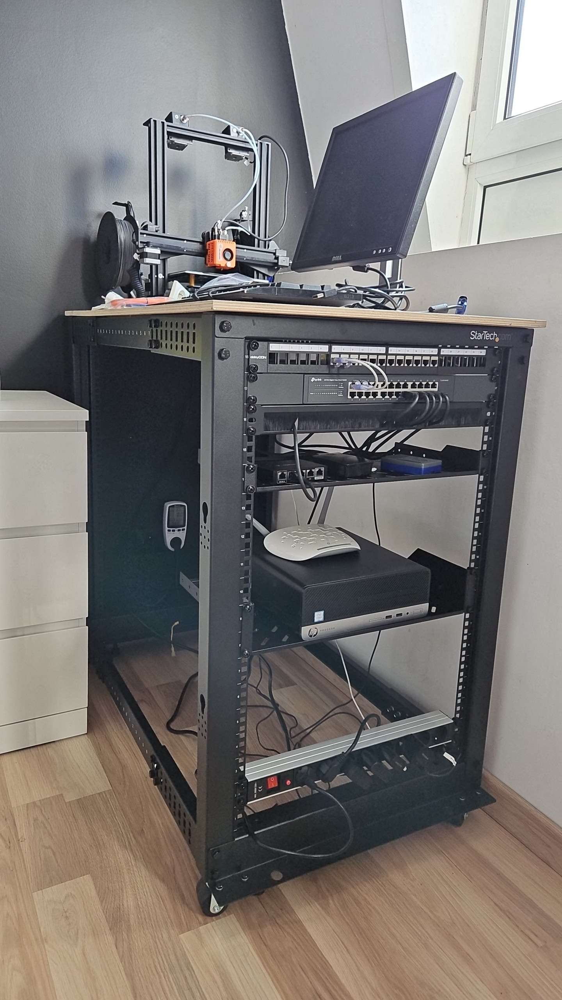

<nav id="toc">
  <ul>
    <li><a href="#1-introduction">Introduction</a></li>
    <li><a href="#2-materiel--infrastructure-physique">Materiel & Infrastructure physique</a></li>
    <li><a href="#3-réseau">Réseau</a></li>
    <li><a href="#4-virtualisation--vms-proxmox">Virtualisation & VMs (Proxmox)</a></li>
    <li><a href="#5-services-hébergés">Services hébergés</a></li>
    <li><a href="#6-déploiement--gestion">Déploiement & gestion</a></li>
    <li><a href="#7-versions--évolution">Versions & évolution</a></li>
    <li><a href="#8-objectifs-futurs">Objectifs futurs</a></li>
  </ul>
</nav>

  

<!-- 1. Introduction -->
## 1. Introduction

  

    Mon homelab sert à apprendre, tester des architectures, héberger des services personnels et fournir un
    environnement de développement proche de la production. Il combine matériel physique (rack / serveurs / switchs),
    virtualisation (Proxmox) et une collection de services conteneurisés.
  

  <!-- schéma global -->
  

    
    
Vue d’ensemble : matériel, virtualisation, réseau et services (schéma simplifié).

  

<!-- 2. Matériel & Infrastructure physique -->
## 2. Materiel & Infrastructure physique

  
Liste synthétique du matériel principal et de l’infrastructure physique.

  <ul>
    <li><strong>Serveurs :</strong> 1-2 nœuds Proxmox (CPU, RAM, stockage)</li>
    <li><strong>Switchs :</strong> switch manageable avec support VLAN</li>
    <li><strong>Routeurs / Firewall :</strong> equipment pour routage et filtrage</li>
    <li><strong>Stockage :</strong> NAS / disques (RAID selon besoin)</li>
    <li><strong>Périphériques :</strong> imprimante 3D (pilotée via OctoPrint), équipements IoT</li>
  </ul>

  

    
    
Photo du rack / armoire serveur (exemple).

  

<!-- 3. Réseau -->
## 3. Réseau

  

    Le réseau est segmenté par VLANs pour isoler les zones (infrastructure, services, IoT, DMZ). Un VPN assure
    l’accès distant sécurisé. Le firewall applique des règles entre les segments et filtre l’accès externe.
  

  

    
    
Schéma réseau : VLANs, firewall, VPN et séparation des environnements.

  

<!-- 4. Virtualisation & VMs -->
## 4. Virtualisation & VMs (Proxmox)

  

    Proxmox est l’hyperviseur central. Les services sont déployés dans des VMs ou des conteneurs LXC selon le besoin.
    Quelques VMs clés sont dédiées au développement et à la production.
  

  <!-- tableau VMs -->
  <figure>
    <table>
      <caption>VMs principales</caption>
      <thead>
        <tr>
          <th>Nom</th>
          <th>Rôle</th>
          <th>Services</th>
          <th>Remarques</th>
        </tr>
      </thead>
      <tbody>
        <tr>
          <td>vm-dev</td>
          <td>Développement / staging</td>
          <td>Traefik, Docker, GitLab, GitLab Runner</td>
          <td>Réseau interne, accès restreint</td>
        </tr>
        <tr>
          <td>vm-prod</td>
          <td>Production</td>
          <td>Traefik, Docker (services exposés)</td>
          <td>VM exposée (reverse proxy + NAT)</td>
        </tr>
        <tr>
          <td>vm-monitor</td>
          <td>Monitoring & notifications</td>
          <td>Uptime-Kuma, ntfy</td>
          <td>Alerting interne</td>
        </tr>
      </tbody>
    </table>
    <figcaption>Tableau synthétique des VMs importantes.</figcaption>
  </figure>

<!-- 5. Services hébergés -->
## 5. Services hébergés

  
Principaux services organisés par catégorie.

  <h4>Administration & Dev</h4>
  <ul>
    <li>GitLab (dépôt & CI), GitLab Runner</li>
    <li>Portainer (gestion Docker)</li>
    <li>Traefik (reverse proxy)</li>
    <li>homepage.dev (page d’accueil interne)</li>
  </ul>

  <h4>Sécurité & Auth</h4>
  <ul>
    <li>Bitwarden (vault)</li>
    <li>Authentik (SSO / gestion identités)</li>
    <li>Pi-hole (filtrage DNS)</li>
  </ul>

  <h4>Surveillance & Notifications</h4>
  <ul>
    <li>Uptime-Kuma (monitoring temps réel)</li>
    <li>ntfy (notifications)</li>
  </ul>

  <h4>Perso / Divers</h4>
  <ul>
    <li>OctoPrint (imprimante 3D)</li>
    <li>Serveur Minecraft</li>
    <li>Slash (outil perso)</li>
    <li>Cloudflared (tunnel / DNS) et autres outils d’accès</li>
  </ul>

  

    
    
Exemple : dashboard / homepage interne.

  

<!-- 6. Déploiement & gestion (Docker-compose) -->
## 6. Déploiement & gestion

  

    Les services sont principalement déployés via <strong>Docker Compose</strong>. Les images sont construites localement
    ou récupérées depuis un registre, et lancées sur les VMs appropriées. Les mises à jour sont réalisées manuellement ou via
    scripts d’assistance pour orchestrer restart / backup.
  

  

    
    
Extrait simplifié d’un fichier <code>docker-compose.yml</code> utilisé.

  

<!-- 7. Versions (V1 / V2) -->
## 7. Versions & évolution

  

    <strong>V1</strong> : infrastructure initiale en place (Proxmox, services de base, réseau segmenté).  
    <strong>V2</strong> : en préparation — objectifs : meilleure isolation réseau, montée en performance, automatisation accrue, et rationalisation des backups.
  

<!-- 8. Objectifs futurs -->
## 8. Objectifs futurs

  <ul>
    <li>Automatiser les déploiements et la configuration (ex. Ansible / scripts)</li>
    <li>Renforcer la sécurité réseau et le monitoring</li>
    <li>Documenter et publier certains modèles (playbooks / templates)</li>
    <li>Finaliser V2 (matériel + architecture)</li>
  </ul>

