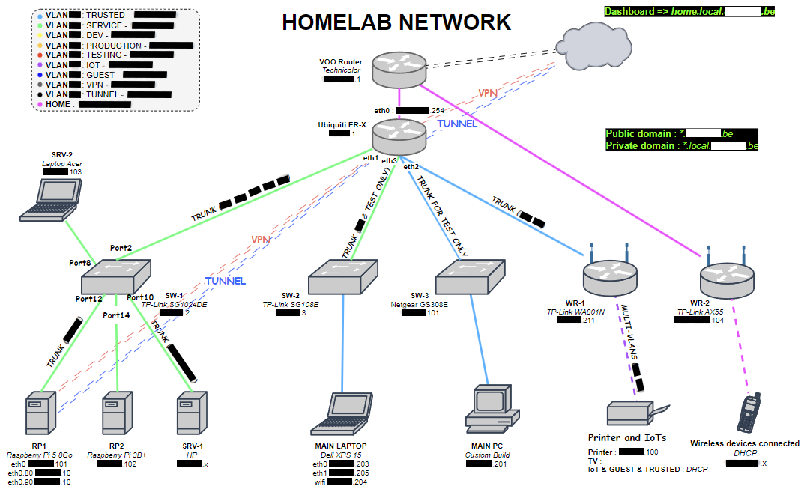

<nav id="toc">
  <ul>
    <li><a href="#1-introduction">Introduction</a></li>
    <li><a href="#2-materiel--infrastructure-physique">Materiel & Infrastructure physique</a></li>
    <li><a href="#3-réseau">Réseau</a></li>
    <li><a href="#4-virtualisation--vms-proxmox">Virtualisation & VMs (Proxmox)</a></li>
    <li><a href="#5-services-hébergés">Services hébergés</a></li>
    <li><a href="#6-déploiement--gestion">Déploiement & gestion</a></li>
    <li><a href="#7-versions--évolution">Versions & évolution</a></li>
    <li><a href="#8-objectifs-futurs">Objectifs futurs</a></li>
  </ul>
</nav>

  

<!-- 1. Introduction -->
## 1. Introduction

  

    Mon homelab sert à apprendre, tester des architectures, héberger des services personnels et fournir un
    environnement de développement proche de la production. Il combine matériel physique (rack / serveurs / switchs),
    virtualisation (Proxmox) et une collection de services conteneurisés.
      
    Pour des raisons de sécurité, certaines informations ont été modifiées ou généralisées. Les schémas et descriptions ne reflètent donc pas exactement la configuration réelle de mon homelab.
  

  <!-- schéma global -->
  

    
  

<!-- 2. Matériel & Infrastructure physique -->
## 2. Materiel & Infrastructure physique

  
Liste synthétique du matériel principal et de l’infrastructure physique.

  <ul>
    <li><strong>Serveurs :</strong> 1 serveur Proxmox (3 VMs), un laptop et 2 Raspberry pi</li>
    <li><strong>Switchs :</strong> 3 switchs manageables</li>
    <li><strong>Routeurs / Firewall :</strong> 1 Ubiquiti ER-X</li>
    <li><strong>Périphériques :</strong> imprimante classique, imprimante 3D, équipements IoT</li>
  </ul>

  

    
    
Photo du rack / armoire serveur (non contractuelle).

  

<!-- 3. Réseau -->
## 3. Réseau

  

    Mon homelab repose sur une architecture réseau segmentée afin d’isoler les usages et renforcer la sécurité. 
    Plusieurs VLAN sont utilisés pour séparer les environnements (production, développement, IoT, invités, etc.), avec un pare-feu configuré pour limiter la communication entre les segments. 
    L’accès distant est sécurisé via un VPN et des tunnels sécurisés, ce qui permet de gérer les services à distance tout en minimisant l’exposition directe sur Internet. 
    Un DNS interne facilite la résolution des noms locaux, tandis qu’un DNS public gère les services accessibles depuis l’extérieur. Les certificats SSL sont déployés automatiquement pour garantir un chiffrement bout-à-bout.
  

  

    
    
Vue d’ensemble : matériel, réseau et services (non contractuelle).

  

<!-- 4. Virtualisation & VMs -->
## 4. Virtualisation & VMs (Proxmox)

  

    Mon homelab repose sur une infrastructure virtualisée avec Proxmox.
    J’y héberge plusieurs machines virtuelles, chacune ayant un rôle bien défini :
  

  <ul>
    <li>VM Développement : environnement dédié à la gestion et au déploiement d’applications en phase de test.</li>
    <li>VM Production : héberge les applications stables et opérationnels.</li>
    <li>VM Multi-services : regroupe certains outils et applications utilitaires.</li>
  </ul>

  Cette séparation permet d’isoler les environnements, de limiter les risques en cas d’incident, et de segmenter l’utilisation des ressources matérielles dans le réseau.

<!-- 5. Services hébergés -->
## 5. Services hébergés

  

    Mon homelab héberge une série de services couvrant le développement, l'administration, la sécurité et des usages personnels.
    Le déploiement est principalement réalisé via <strong>Docker Compose</strong>, la supervision et la gestion des conteneurs se fait avec <strong>Portainer</strong>,
    et le routage/gestion des certificats est centralisé via <strong>Traefik</strong>.
  

  
  

    <em>Remarque&nbsp;: les descriptions et illustrations ci-dessous sont à visée pédagogique. Certains détails ont été généralisés pour préserver la sécurité de l’infrastructure.</em>
  

  
  <h3>Exemples de services hébergés (par catégorie)</h3>
  
  <h4>Administration & supervision</h4>
  <ul>
    <li><strong>Portainer</strong> — interface de gestion des containers et supervision rapide.</li>
    <li><strong>Traefik</strong> — reverse proxy et gestion automatique des certificats TLS.</li>
    <li><strong>Uptime-Kuma</strong> — monitoring de disponibilité des services.</li>
    <li><strong>Homepage</strong> — dashboard interne centralisant les accès aux services.</li>
  </ul>
  
  <h4>Sécurité & identité</h4>
  <ul>
    <li><strong>Authentik</strong> — gestion des accès / SSO pour centraliser les authentifications.</li>
    <li><strong>Bitwarden</strong> — coffre de mots de passe auto-hébergé.</li>
    <li><strong>Pi-hole</strong> &amp; <strong>CoreDNS</strong> — filtres DNS et résolution interne.</li>
    <li><strong>Cloudflared</strong> — tunnel sécurisé pour exposer certains services sans ouvrir directement de ports publics.</li>
  </ul>
  
  <h4>Développement & CI</h4>
  <ul>
    <li><strong>GitLab</strong> — dépôt de code et gestion des projets.</li>
    <li><strong>GitLab Runner</strong> — exécution des jobs CI pour builds/tests.</li>
    <li><strong>Slash</strong> — petit service de redirection d’URL personnalisé.</li>
  </ul>

  <h4>Surveillance & notifications</h4>
  <ul>
    <li><strong>ntfy</strong> — système de notifications push simple et léger.</li>
    <li><strong>Uptime-Kuma</strong> (déjà cité) — monitoring et alerting.</li>
  </ul>

  <h4>Perso & loisirs</h4>
  <ul>
    <li><strong>OctoPrint</strong> — interface pour piloter l’imprimante 3D.</li>
    <li><strong>Serveur Minecraft</strong> — serveur privé pour tests / usage personnel.</li>
  </ul>

  

    
    
Dashboard gethomepage.dev.

  

  
  

    L’ensemble est pensé pour être modulaire et reproductible : chaque service peut être démarré/arrêté ou répliqué via des fichiers
    <code>docker-compose.yml</code> bien documentés, ce qui facilite les tests, mises à jour et migrations.
  

<!-- 6. Déploiement & gestion (Docker-compose) -->
## 6. Déploiement & gestion

  

    Les services sont principalement déployés via <strong>Docker Compose</strong>. Les images sont construites localement
    ou récupérées depuis un registre, et lancées sur les VMs appropriées. Les mises à jour sont réalisées manuellement ou via
    scripts d’assistance pour orchestrer restart / backup.
  

  

    
    
Extrait simplifié d’un fichier <code>docker-compose.yml</code> utilisé.

  

<!-- 7. Versions (V1 / V2) -->
## 7. Versions & évolution

  

    <strong>V1</strong> : infrastructure initiale en place (Proxmox, services de base, réseau segmenté).  
    <strong>V2</strong> : en préparation — objectifs : meilleure isolation réseau, montée en performance, automatisation accrue, et rationalisation des backups.
  

<!-- 8. Objectifs futurs -->
## 8. Objectifs futurs

  <ul>
    <li>Automatiser les déploiements et la configuration (ex. Ansible / scripts)</li>
    <li>Renforcer la sécurité réseau et le monitoring</li>
    <li>Documenter et publier certains modèles (playbooks / templates)</li>
    <li>Finaliser V2 (matériel + architecture)</li>
  </ul>

