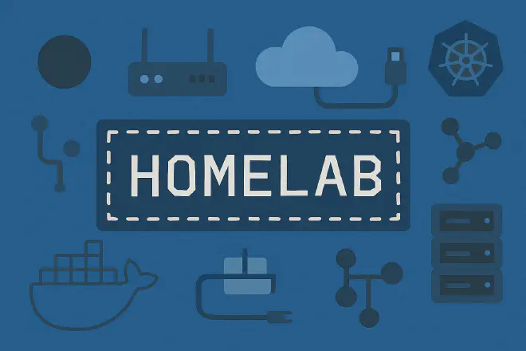

<!-- Navbar -->

  <a href="#a-propos">À propos</a> •
  <a href="#projets">Projets</a> •
  <a href="#mon-cv">Mon C.V.</a> •
  <a href="#contact">Contact</a>

---

## À propos
Je suis passionné par l’informatique depuis plusieurs années, avec un intérêt particulier pour le développement et l’administration des systèmes et réseaux.

Mon objectif actuel est de débuter ma carrière comme développeur full-stack ou technicien systèmes et réseaux, tout en continuant à me perfectionner sur les aspects techniques et architecturaux des systèmes.

Actuellement à la recherche d’opportunités en tant que **développeur junior** ou **technicien support/système**,  
je construis des projets personnels pour développer mes compétences techniques.

---

## Projets

<!-- Projet 1 -->

  

    <h3>Fritly – Application interne pour une friterie</h3>
    

      <strong>Contexte :</strong> Travaillant dans une friterie depuis plusieurs années, j’ai remarqué de nombreuses tâches redondantes (gestion du planning, procédures internes, recettes, etc.) qui pouvaient être centralisées dans un outil unique. J’ai décidé de créer une application interne pour centraliser ces informations et simplifier la gestion quotidienne. 
      <strong>Fonctionnalités principales :</strong> 
      <ul>
        <li>Gestion et visualisation des plannings.</li>
        <li>Consultation des procédures (postes, nettoyages, recettes).</li>
        <li>Accès aux fiches d’actions quotidiennes et recettes spéciales du mois.</li>
      </ul>
      <strong>Architecture et outils :</strong> 
      <ul>
        <li>PWA pour unifier desktop et mobile sans développement natif.</li>
        <li>Angular + Spring + PostgreSQL : un stack robuste, modulaire et maintenable pour gérer à la fois l’interface, l’API et la base de données.</li>
        <li>CI/CD avec GitLab déployé automatiquement sur mon homelab pour simuler un environnement de production réel.</li>
        <li>Organisation et suivi du projet via Jira, développement sur IntelliJ IDEA.</li>
      </ul>
      Rôle : Développement complet (analyse, conception, backend, frontend, infrastructure) en collaboration avec un designer UI/UX.
    

    

      Ce projet m’a permis de mettre en place une architecture complète :
      pipeline CI/CD, orchestration des services avec Docker,
      gestion de projet via Jira, et un déploiement automatisé.
    

  

  

    
  

---

<!-- Projet 2 -->

  

    <h3>Homelab</h3>
    

      <strong>Type :</strong> Infrastructure personnelle  
      <strong>Objectif :</strong> Expérimenter et simuler un environnement professionnel
    

    

      Mon homelab comprend un serveur rack, plusieurs machines virtuelles, 
      un schéma réseau segmenté, et des services critiques comme un reverse proxy,
      des outils de monitoring et des solutions de virtualisation.
    

    

      J’ai documenté toute l’architecture et conçu un schéma réseau clair pour visualiser la topologie.
    

  

  

    
  

---

## Mon CV
[**Télécharger mon CV (PDF)**](assets/Curriculum_Mattéo_2025_job_developpeur_fullstack.pdf){:target="_blank"}

---

## Contact
- **Email** : matt.dewaegheneire@gmail.com
- **LinkedIn** : [Mattéo Dewaegheneire](https://www.linkedin.com/in/matt%C3%A9o-dewaegheneire-9a541629a/)  
- **GitHub** : [MatteoDwg](https://github.com/MatteoDwg)
